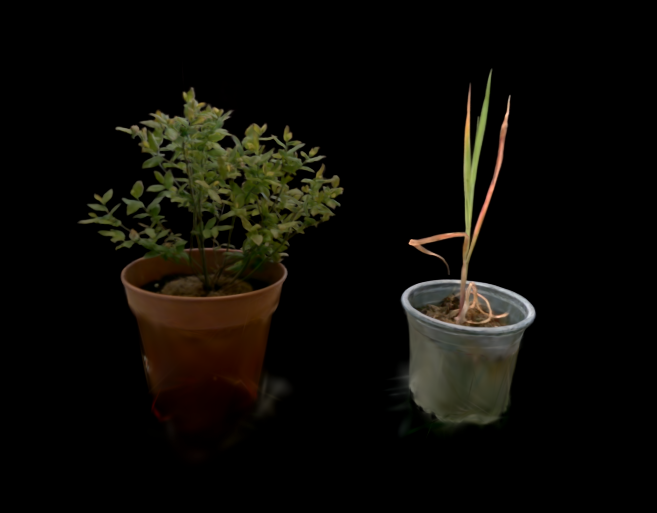
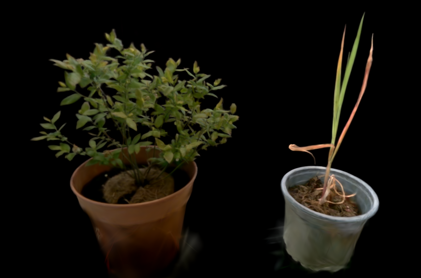

# SynthPlant3D

|  |  |

To install dependencies run:

You might have to jimmy this script to get it work.

```bash
wget https://github.com/IntelRealSense/librealsense/raw/master/scripts/libuvc_installation.sh
chmod +x ./libuvc_installation.sh
./libuvc_installation.sh -DBUILD_PYTHON_BINDINGS:bool=true
```

Then you'll want to use the command:

```bash
pip install -r requirements.txt
```

